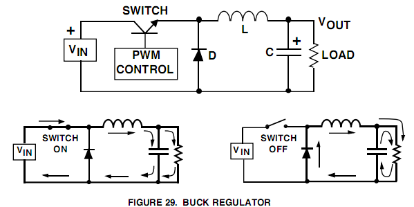
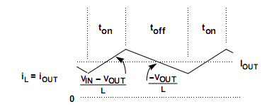
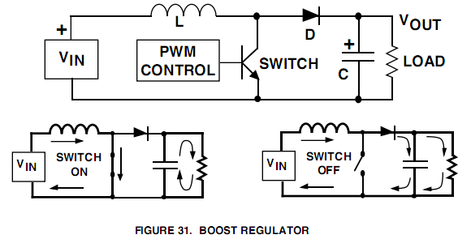
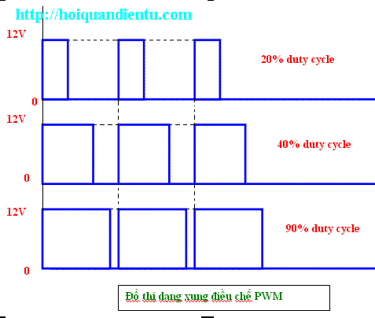
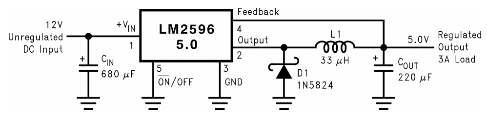
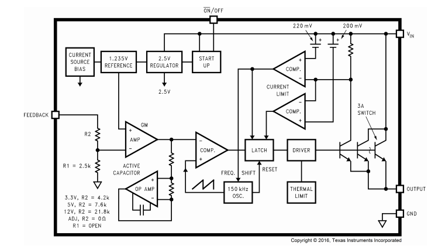
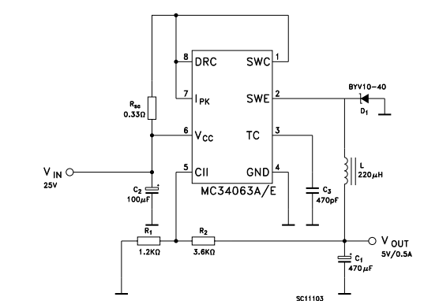
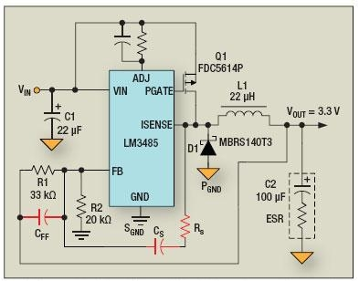
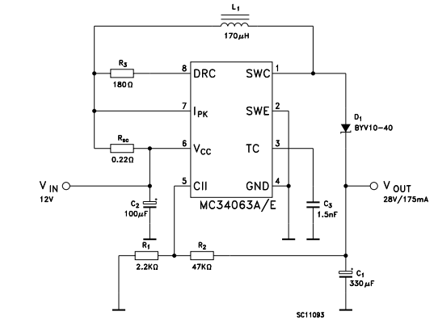

#Nguồn xung không cách ly
##Nguồn xung kiểu Buck

Đây là kiểu biến đổi nguồn cho điện áp đầu ra nhỏ hơn so với điện áp đầu vào. Vin > Vout

**Mạch nguyên lý như sau:**

**Nguyên lý hoạt động:**

Dùng một van đóng cắt nguồn điện và phần lọc đầu ra. Điện áp đầu ra được điều biến theo độ rộng xung. 

Khi "Switch On" được đóng tức là nối nguồn vào mạch thì lúc đó dòng điện đi qua cuộn cảm và dòng điện trong cuộn cảm tăng lên, tại thời điểm này thì tụ điện được nạp đồng thời cũng cung cấp dòng điện qua tải. 

Khi "Swich Off" tức là ngắt nguồn ra khỏi mạch. Khi đó trong cuộn cảm tích lũy năng lượng từ trường và tụ điện tích lũy điện trường trước đó sẽ phóng qua tải.

Cuộn cảm giữ cho dòng diện không đổi và giảm dần. 

Quá trình đóng cắt liên tục tạo ở tải một điện áp trung bình theo quy luật băm xung PWM. Dòng điện qua tải sẽ ở dạng xung tam giác đảm bảo cho dòng điện liên tục qua tải thì tần số đóng cắt khá cao để đảm bảo triệt nhiễu công suất cho mạch. Van công suất thường sử dụng các van như transistor tốc độ cao, Mosfet hay IBGT...

Điện áp đầu ra được tính:

__Vout = Vin * (ton/(ton+toff) = Vin * D (với D là độ rộng xung %)__

ton, toff lần lượt là thời gian mở và thời gian khóa của van.

Với kiểu nguồn Buck này thì cho dòng ngõ ra lớn hơn so với dòng ngõ vào vì sử dụng cuộn cảm, tổn hao công suất thấp. Do vậy nên nguồn buck được sử dụng nhiều trong các mạch giảm áp nguồn DC.

####Tính toán cơ bản cho mạch nguồn Buck

#####4 thông số sau cần thiết để tính toán thiết kế bộ nguồn:

1. Khoảng điện áp ngõ vào: Vin(min) và Vin(max)
2. Điện áp ngõ ra: Vout
3. Dòng điện ngõ ra max: Iout(max)
4. IC sử dụng cho mạch nguồn buck. Nó cũng quan trọng, vì một vài thông số tính toán bắt nguồn từ datasheet của IC. (Trong bài viết này không quan trọng thông số này, do người viết muốn tự tính toán xây dựng mạch buck sử dụng vi điều khiển)

#####Tính toán dòng maximum

Đầu tiên để tính toán ở bước này cần tính hệ số duty cycle, D với điện áp vào maximum.

Maximum Duty Cycle: D = (Vout)/(Vin(max) x n)

Vin(max): điện áp ngõ vào max

Vout: điện áp ngõ ra

n: hiệu suất chuyển đổi, thường ước tính 90%.

Xác định dòng điện gợn sóng bởi cuộn cảm 

Inductor Ripple Current: 

\alpha

##Nguồn xung kiểu Boot

Đây là kiểu biến đổi nguồn cho điện áp đầu ra lớn hơn điện áp đầu vào. Vout > Vin

**Mạch nguyên lý như sau:**

**Nguyên lý hoạt động:**

Khi *switch on* thì dòng điện trong cuộn cảm được tăng lên rất nhanh, dòng điện qua cuộn cảm va switch xuống gnd. Chiều bên trái cuộn dây mang dấu dương. Dòng điện không qua diode và tụ điện, ở thời điểm này thì tụ điện phóng điện cung cấp cho tải. Chiều của dòng điện như hình vẽ.

Khi *switch off* dòng điện giảm, nhưng có xu hướng chống lại bởi cuộn dây, chiều cuộn dây bị đảo ngược lại bên trái mang dấu âm. Điện áp đầu vào cùng với điện áp cuộn cảm qua diode cấp cho tải và đồng thời nạp cho tụ điện. Khi đó điện áp đầu ra sẽ lớn hơn điện áp đầu vào, dòng qua tải được cấp bởi điện áp đầu vào. Chiều của dòng điện như hình vẽ.

Điện áp qua tải còn còn phụ thuộc vào giá trị của cuộn cảm tích lũy năng lượng và điều biến độ rộng xung. Tần số đóng cắt khá cao hàng Khz để triệt nhiễu công suất và tăng công suất đầu ra. Dòng qua van đóng cắt nhỏ hơn dòng đầu ra. Van công suất thường là các transistor tốc độ cao, Mosfet hay IBGT,... Diode là diode xung, công suất.

Điện áp đầu ra được tính như sau:

__Vout = ((Ton / Tdon) + 1) x Vin__

__Ipk = 2 x Iout,max x (Vout / Vin,min)__
__Tdon = (L x Ipk) / (Vout - Vin)__

Ton là thời gian mở của van

Ipk là dòng điện đỉnh

Trong nguồn boot thì điện áp đầu ra lớn hơn so với điện áp đầu vào, do đó công suất đầu vào phải lớn hơn công suất đầu ra. Công suất đầu ra phụ thuộc vào cuộn cảm L. Hiệu suất nguồn boot cũng khá cao nên được sử dụng trong các mạch nâng áp do nó truyền trực tiếp nên công suất của nó rất lớn. 

Nguồn boot có 2 chế độ: 

Chế độ không liên tục: Nếu điện cảm của cuộn cảm quá nhỏ, thì trong một chu kỳ đóng cắt, dòng điện sẽ tăng dần nạp năng lượng cho cuộn cảm rồi giảm dần phóng năng lượng từ cuộn cảm sang tải. Vì điện cảm nhỏ nên năng lượng trong cuộn cảm cũng nhỏ nên hết một chu kỳ thì năng lượng trong cuộn cảm cũng giảm đến 0. (tức là trong một chu kỳ dòng điện sẽ tăng từ 0 -> max rồi giảm về 0).

Chế độ liên tục: Nếu điện cảm của cuộn cảm rất lớn, thì dòng điện trong một chu kỳ đóng cắt sẽ không thay đổi nhiều mà chỉ dao động quanh giá trị trung bình. Chế độ liên tục có hiệu suất và chất lượng bộ nguồn tốt hơn nhiều so với chế độ không liên tục nhưng đòi hỏi cuộn cảm phải có giá trị lớn hơn nhiều lần. 

#Phương pháp điều xung PWM (PULSE WIDTH MODULATION)

Phương pháp điều xung PWM là phương pháp điều chỉnh điện áp ra tải, là phương pháp điều chế dựa trên sự thay đổi độ rộng của chuỗi xung vuông, dẫn đến sự thay đổi điện áp ra. 

Các xung PWM khi biến đổi có cùng một tần số và khác nhau về độ rộng sườn dương, sườn âm.

PWM ứng dụng nhiều trong điều khiển, thường gặp như điều khiển động cơ, điều khiển các bộ xung áp, điều áp,... PWM tham gia các bộ điều chế các mạch nguồn như boot, buck, nghịch lưu 1 pha, 3 pha.

 
#Mạch ứng dụng nguồn buck sử dụng IC chuyên dụng

##LM2596

LM2596 kiểu chân TO-263 là một IC ổn áp dạng xung DC – DC. Điện áp đầu vào lớn nhất tới 40V, và thấp nhất 4.5V. Điện áp đầu ra điều chỉnh được trong khoảng 1.5V – 37V, dòng điện đầu ra đạt 3A hiệu xuất cao nhờ ứng dụng cơ chế băm xung ở tần số lên tới 150KHz. Trong quá trình hoạt động LM2596 luôn được đặt trong các chế độ bảo vệ quá nhiệt và quá dòng.

LM2596 đã tích hợp sẵn BJT đóng ngắt bên trong nên chỉ cần mắc diode và cuộn cảm bên ngoài. Xem sơ đồ khối của LM2596 để hiểu rõ hơn.

##MC34063

##LM3485

Ngoài ra còn rất nhiều IC chuyên dụng khác như TL494, LM3485, L2576,...

#Mạch ứng dụng nguồn buck sử dụng vi điều khiển

#Mạch ứng dụng nguồn boot sử dụng IC chuyên dụng
##MC34063

#Mạch ứng dụng nguồn boot sử dụng vi điều khiển