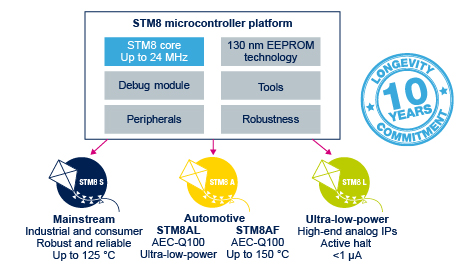
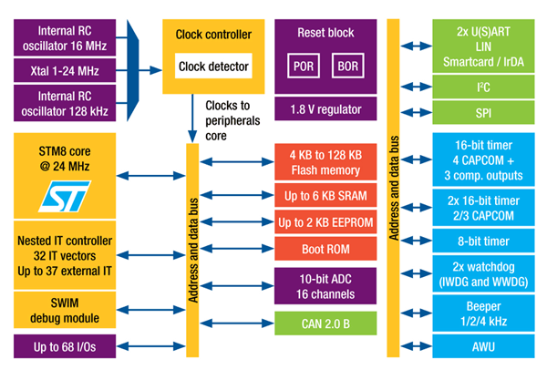
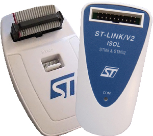
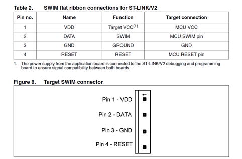
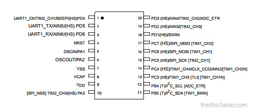

#Giới thiệu vi điều khiển STM8, Công cụ lập trình, nạp code cho STM8#
 
##1. Giới thiệu vi điều khiển STM8##

 STM8 là một nền tảng lõi vi điều khiển 8 bit mạch mẽ của ST với rất nhiều ngoại vi phổ biến. Nó được sản xuất trên công nghệ 130 nm, được nhúng sẵn bộ nhớ để lưu dữ liệu khi không cung cấp điện (non-volatile memory). Nền tảng STM8 có 4 dòng chip như sau:

 - STM8S là dòng vi điều khiển chính, đáp ứng với các nhu cầu thông dụng.
 - STM8L là dòng vi điều khiển tiết kiệm năng lượng, thích hợp cho các ứng dụng dùng PIN, IoT,...
 - STM8AF and STM8AL là dòng vi điều khiển dành cho các ứng dụng trong ngành công nghiệp ô tô. Mức độ ổn định cao nhất trong các dòng STM8.​

Dòng vi điều khiển STM8 thông dụng ở Việt Nam là STM8S với các đại diện tiêu biểu là các chip STM8S003F3P6, STM8S103K3T6,... Sở dĩ có điều đó bởi giá thành của chúng rất thấp so với mặt bằng chung, nhưng sức mạnh và ngoại vi không hề thua kém và sự hỗ trợ của hãng rất nhiều. 

Ví dụ đối với STM8S003F3P6, thông số cấu hình cơ bản như sau:
Clock   16MHz    
Flash   8kB  
RAM 1kB  
EEPROM  128B     
Timer ( PWM, CCP, WDT, ...) 3(1x8+2x16)  
UART, ADC (10bit), SPI, I2C, WDT, beep,...  

Chip STM8 điện áp hoạt động 2.95V-5.5V với dòng STM8S, 1.8V-3.6V với dòng STM8L, 3V-5.5V với dòng STM8AF.

##2. Công cụ lập trình, biên dịch nạp code cho chip STM8##

Để lập trình và tải code vào chip, chúng ta có thể sử dụng IDE của hãng ST hoặc của hãng thứ 3 (IAR, ...)
         
Đối với IDE của ST. Sau khi cài đặt sẽ được bộ công cụ gồm STVD(ST Visual Develop) để viết chương trình, biên dịch thành mã máy (.hex) và STVP (ST Visual Programmer) để nạp chương trình cho chip. Tuy nhiên sử dụng công cụ này, chúng ta phải cài đặt tool chain (Cosmic,... ), việc này sẽ khá phức tạp đối với người sử dụng. Tải bộ công cụ ST Toolset tại đây: [link](http://www.st.com/content/st_com/en/products/development-tools/software-development-tools/stm8-software-development-tools/stm8-programmers/stvd-stm8.html?sc=internet/evalboard/product/210567.jsp#)
        
IDE của hãng IAR dành cho STM8: [link](https://www.iar.com/iar-embedded-workbench/#!?architecture=STM8&currentTab=overview)

IDE Sublime Text và SDCC compiler: [link](https://www.sublimetext.com/3), [link](http://sdcc.sourceforge.net/)
 
Thư viện chuẩn của STM8: [link](http://www.st.com/content/st_com/en/products/embedded-software/mcus-embedded-software/stm8-embedded-software/stsw-stm8069.html)

Mạch nạp STM8 dùng ST-Link V2: 

Kết nối mạch nạp và board theo thứ tự chân như hình: 

##3. Cách học STM8 cho người mới tìm hiểu##

STM8 là vi điều khiển được hãng sản xuất hỗ trợ rất nhiều, đặc biệt là code mẫu, ví dụ, sơ đồ nguyên lý,... Đơn giản nhất đối với người mới nghiên cứu là học qua ví dụ. Vì hầu hết chip STM8 là dòng chip dán SMD nên dùng mạch in thủ công sẽ không phù hợp. Hơn nữa KIT phát riển do dòng này khá rẻ, đặc biệt các kit mini ra chân.
       
Qua thực tế bản thân, tôi đề xuất phương pháp học STM8 cho người mới nghiên cứu là: Mua KIT sẵn (có thể là KIT mini, STM8  - discovery,...), tải code mẫu của hãng, dùng trình biên dịch IAR. Các bài hướng dẫn tiếp theo, tôi cũng sẽ thực hiện trên các nền tảng này mà thôi.
   
Các bài viết sau đây dành cho người tự học STM8, tôi sẽ sử dụng ví dụ, phân tích ví dụ để cho người đọc hiểu được cách cấu hình cho chíp hoạt động( thạch anh nội, ngoại, tần số,...), cách cấu hình cho một ngoại vi và thao tác với ngoại vi đó, từ ngoại vi cơ bản như GPIO, UART, ADC, SPI,....Song song với đó là các bài bổ túc về ngôn ngữ lập trình như cấu trúc, phép toán so sánh, thao tác bit,....
       
##4. Thiết kế phần cứng với STM8##
###4.1. Yêu cầu thiết kế bộ điều khiển tay hàn ###

Phân tích yêu cầu thiết kế ta nhận thấy để điều khiển tay hàn cần có:
- Ngõ ra điều xung 
- Ngõ vào ADC đọc giá trị nhiệt độ yêu 
- Ngõ vào ADC đọc giá trị nhiệt độ hồi tiếp từ tay hàn
- Chân quét led 7 đoạn

Chọn chip STM8S003F3 20 pin

- Chân PWM sử dụng TIM2_CH1 chân số 1, có thể sử dụng chân TIMx_CH bất kỳ, chú ý đọc datasheet để biết Timer bao nhiêu bit để sử dụng, các chân TIMx_CH nằm trong ngoặc vuông không nên sử dụng vì dùng chân đó phải set lại option bit vì nó nằm ở mode Alternate function. Đọc ở mục pinout and pin description trong datasheet.
- Chân ADC thì chọn chân AINx bất kỳ.
- Các chân còn lại sử dụng cho quét led.
- Có thể dùng thạch anh ngoài nối vào OSCIN và OSCOUT hoặc dùng thạch anh nội.

###4.2. Yêu cầu thiết kế bộ điều khiển đèn led RGB ###

Với bộ điều khiển led RGB thì ta cần:
- 3 ngõ ra điều xung 
- 3 ngõ vào ADC đọc giá trị để chỉnh cường độ màu.

Chọn chip như trên và 3 kênh: TIM2_CH1, TIM2_CH2, TIM2_CH3 và 3 ngõ AINx bất kỳ.

###4.3. Yêu cầu thiết kế bộ đọc cảm biến khoảng cách siêu âm giao tiếp qua RS485###
  
Với bộ đọc cảm biến khoảng cách siêu âm thì ta cần:
- 1 ngõ ra tạo xung trigger
- 1 ngõ vào đọc xung echo
- 1 cổng UART để giao tiếp 485

Chọn chip như trên: chọn UART1_TX và RX, các chân còn lại chọn bất kỳ.    
