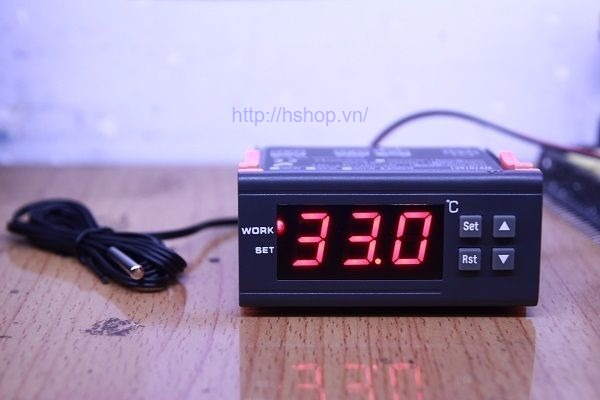
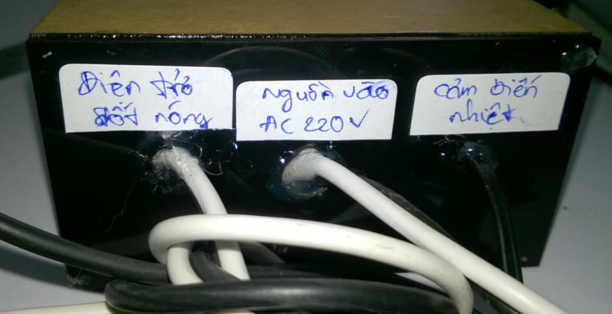
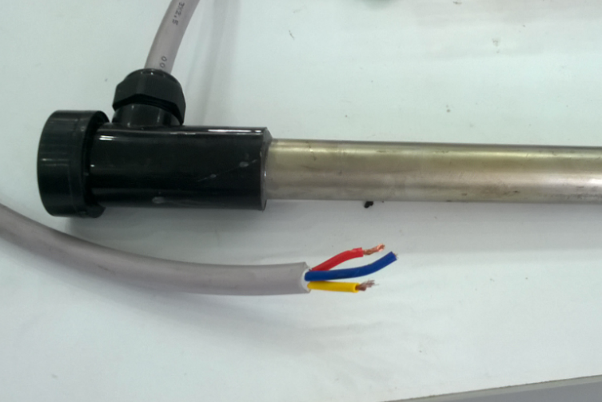
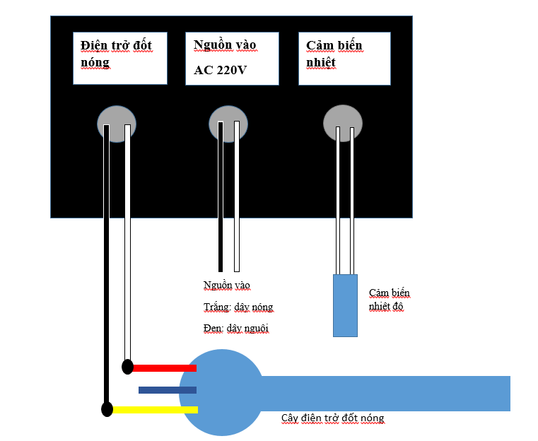
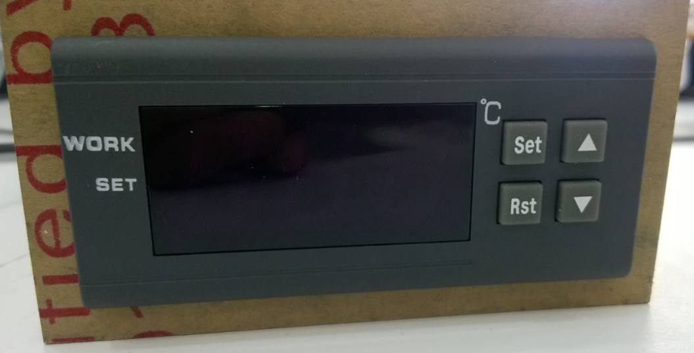

#Tài liệu hướng dẫn sử dụng máy điều nhiệt

Thiết bị đo nhiệt độ có relay kích ngõ ra dùng để điều chỉnh ngưỡng nhiệt độ mong muốn. Thiết bị dùng đo nhiệt độ sau đó điều khiển đóng mở relay để điều khiển thiết bị làm nóng. Thiết bị với kiểu dáng công nghiệp, sử dụng trực tiếp điện áp 220V, ngõ ra relay chịu dòng đến 30A. Hình dáng nhỏ gọn, dễ dàng sử dụng lắp đặt trong tủ điện công nghiệp.

##Thông số kỹ thuật
- Điện áp làm việc: 220VAC
- Công suất ngõ ra tối đa: 30A/220VAC
- Dải nhiệt độ đo: -50oC -> 110oC
- Sai số nhiệt độ đo: +-0.5oC
- Loại cảm biến: NTC (10k/3435)
- Giá trị điều chỉnh nhiệt độ: +-1oC
- Nhiệt độ làm việc: 0oC -> 5oC
- Nhiệt độ bảo quản: -10oC -> 60oC
- Kích thước: 86x75x34 mm

##Sơ đồ đấu dây

Ngõ vào: Nguồn 220V

__Quy định:__

Dây trắng là dây nóng

Dây đen là dây lạnh

Ngõ ra: Nối vào cây điện trở đốt nóng

Trên cây điện trở đốt nóng có 3 dây: dây màu xanh là dây vỏ (không nối hoặc nối đất), 2 dây màu đỏ và vàng là dây nguồn nối vào 2 dây ra trên bộ điều khiển:

Sơ đồ nối dây:

##Hướng dẫn cài đặt chế độ giữ nhiệt

1. Nhấn ***Set*** 1 lần vào mode cài đặt nhiệt độ, nhấn nút tăng giảm để thay đổi giá trị nhiệt độ cần cài đặt. VD: muốn cài đặt 40oC sẽ ngắt thiết bị thì sẽ set là 40, nhấn 1 lần nút ***Set*** nữa để trở về chế độ hiển thị.
2. Ở chế độ hiển thị nhấn giữ nút ***Set*** 3 giây sẽ vào 6 mode cài đặt, nhấn nút tăng giảm để thay đổi mode, cần quan tâm đến __HC, D, PT.__
- **HC**: H làm nóng
- **D**: khoảng nhiệt độ để đóng relay (1-15oC) VD: 40oC ngắt relay, D=2 thì 38oC sẽ đóng relay.
- **PT**: Thời gian delay(0-10 phút), sau khi nhiệt độ xuống dưới mức __giá trị set - giá trị D__ thì sẽ delay sau khoảng __giá trị PT__ phút mới bắt đầu đóng lại relay.

VD:

Nhấn nút set 1 lần để set giá trị nhiệt độ là 40. Nhấn set giữ 3 giây để vào chế độ mode, dùng nút tăng giảm để chọn mode HC sau đó nhấn set rồi chọn H nhấn set để xác nhận, chọn tiếp mode D nhấn set để vào mode rồi chọn 5 độ nhấn set để xác nhận, chọn tiếp mode PT nhấn set để vào mode chọn 1 nhấn set để xác nhận. Bấm giữ Set 3 giây để quay về màn hình hiển thị. 

Hệ thống sẽ hoạt động như sau: khi nhiệt độ trên 40 độ C, relay sẽ ngắt không còn điện áp ra ở điện trở nhiệt. Nhiệt độ bắt đầu giảm đến 35 độ C, sau đó sẽ delay 1 phút mới bắt đầu đóng lại relay. Quá trình lặp lại như vậy để giữ nhiệt theo yêu cầu.

Tùy theo yêu cầu sử dụng mà set theo yêu cầu.

