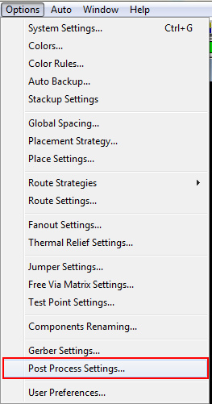
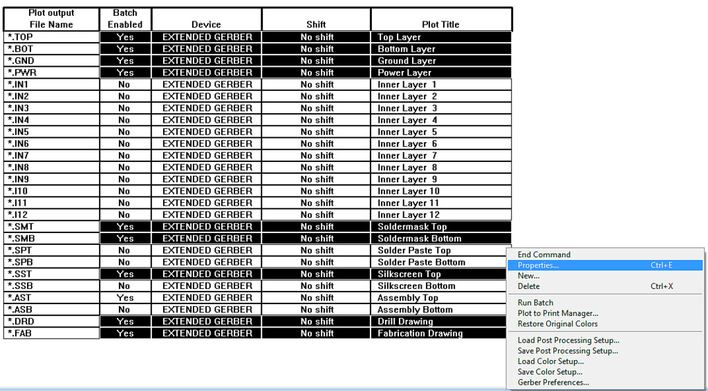
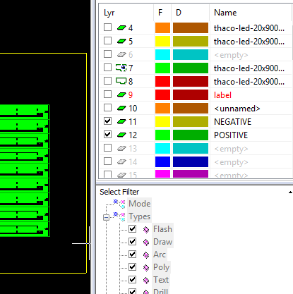

#Cơ bản về Gerber

Gerber là định dạng tập tin nhị phân dạng vector. Đây là định dạng file tiêu chuẩn được sử dụng trong ngành công nghiệp sản xuất bảng mạch in PCB. Nó có chứa các thông tin cần thiết về PCB như các lớp đồng, lớp mặt nạ hàn... Đuôi file chuẩn có thể là .GBR hoặc .gbr.

##Định dạng Gerber:

###Phần mềm Altium:

- *.GTL: Top Layer - Lớp đồng mặt trên.
- *.GTO: Top Overlay - Lớp in tên linh kiện mặt trên.
- *.GTS: Top Solder - Lớp phủ xanh mặt trên.
- *.GTP: Top Paste - Lớp Pad Stencil linh kiện SMD mặt trên.
- *.GBL: Bottom Layer - Lớp đồng mặt dưới.
- *.GBO: Bottom Overlay - Lớp in tên linh kiện mặt dưới.
- *.GBS: Bottom Solder - Lớp phủ xanh mặt dưới.
- *.GBP: Bottom Paste - Lớp Pad Stencil mặt dưới.
- *.GKO: KeepOutLayer - Đường board outline cắt board.
- *.TXT: Drill - File khoan.

###Phần mềm ORCAD: 
- *.TOP: Top Layer - Lớp trên.
- *.SMT: Soldermask Top Lớp phủ xanh mặt trên.
- *.SST: Silkscreen Top - Lớp in tên linh kiện mặt trên.
- *.SPT: Solder Paste Top - Lớp Pad Stencil linh kiện SMD mặt trên.
- *.BOT: Bottom Layer - Lớp dưới.
- *.SMB: Soldermask Bottom - Lớp phủ xanh mặt dưới.
- *.SSB: Silkscreen Bottom - Lớp in tên linh kiện mặt dưới.
- *.SPB: Solder Paste Bottom - Lớp Pad Stencil linh kiện SMD mặt dưới. 
- *.FAD: Fabrication Drawing - Đường định dạng cắt board.
- *.DRD: Drill Drawing - File khoan 

###Phần mềm KiCAD

Ở phần mềm KICAD các file Gerber đều có phần đuôi mở rộng *.gbr, cần chú ý phần phía trước để phân biệt gerber của từng layer.

- -FCu.gbr: Lớp đồng mặt trước.
- -FMask.gbr: Lớp phủ xanh mặt trước.
- -FPaste.gbr: Lớp Pad Stencil linh kiện SMD mặt trước.
- -FSilkS.gbr: Lớp in tên linh kiện mặt trước.
- -BCu.gbr: Lớp đồng mặt sau.
- -BMask.gbr: Lớp phủ xanh mặt sau.
- -BPaste.gbr: Lớp Pad Stencil linh kiện SMD mặt sau.
- -BSilkS.gbr: Lớp in tên linh kiện mặt sau.
- -Edge.Cuts.gbr: Đường định dạng cắt board.
- *.drl: Drill -  File Khoan.

_*Khi xuất gerber chọn "Use Protel filename extesions" phần đuôi mở rộng sẽ giống với phần đuôi mở rộng của Altium để tiện việc xử lý*_

Ngoài ra còn nhiều phần mềm thiết kế mạch khác như Protues, Edgle, sprint layout, Easy EDA, MultiSim,... chúng ta cần tìm hiểu ý nghĩa từng layer để tiện trong việc xử lý gerber tránh nhầm lẫn trong sản xuất.

##Hướng dẫn xuất gerber từ phần mềm Altium:

Hướng dẫn xuất Gerber từ phần mềm Altium Designer

Để tránh những sai sót không đáng có khi gởi file đặt hàng như không mở file được do nhà sản xuất không có phần mềm khách hàng sử dụng, nhân viên xử lý kỹ thuật mở file pcb của khách hàng gây ra thay đổi trên mạch .... Các bạn nên xuất file Gerber để gởi đặt hàng cho nhà sản xuất PCB. Tất cả các nhà sản xuất PCB đều có thể nhận Gerber.

1. Đặt tọa độ 0 cho mạch:

2. Xuất Gerber: File -> Fabrication Outputs -> Gerber Files

Lựa chọn như trong ảnh

Chọn OK là xong

3. Xuất file khoan (Drill): File -> Fabrication Outputs -> NC Drill File (Lựa chọn như trong hình)

OK là xong.

##Hướng dẫn xuất gerber từ phần mềm ORCAD:

1. Đặt tọa độ 0

2. Cấu hình xuất Gerber: Options -> Post Process Settings

Chọn lớp cần xuất, nhấn Properties, cho phép xuất

3. Xuất Gerber Auto -> Run Post Processor

##Hướng dẫn xuất gerber từ phần mềm KICAD:

1. Từ Pcbnew kích File → Plot, xuất hiện hợp thoại.

2. Chọn định dạng vẽ là Gerber ở Plot Format, đường dẫn đến nơi để lưu file Gerber, và chọn các lớp để xuất file Gerber tại Layer. Cuối cùng kích vào nut Plot để tạo các file Gerber
3. Nếu bạn vẽ mạch 2 lớp thì bạn cần chọn như bản sau

#Hướng dẫn cài đặt phần mềm VISUAL CAM:

- Copy file cài đặt về cài đặt bình thường, sau khi cài đặt xong thì vào file README xem hướng dẫn Crack.
- Add Macro xuat-film để hỗ trợ xuất film nhanh chóng:

- Vào Opitions - > Configure.. xuất hiện bảng:

- Chọn Tab Macro Files

- Chọn đường dẫn đến thư mục chứa file macro đã copy. Click OK.

- Sau đó chọn Macro -> Load chọn đường dẫn tới thư mục chứa file macro "xuatfilm" click chọn Open là xong.

- Việc cài đặt VisualCAM và Add Macro đã xong. Add thêm Menu cho tiện sử dụng lựa chọn nhanh khi xuất nhiều film.

- Sửa đường dẫn đến nơi lưu file film: vào thư mục chứa macro "xuatfilm" mở file xuat_film.mac lên sửa đổi như sau: thay bằng đường dẫn chứa film. Sau khi thay đổi đường dẫn xong, vào Visual Cam load lại Macro để lưu thay đổi.

- Vào Opition -> Configure.. Chọn Tab User Menu, Add thêm các lệnh như sau:

#Hướng dẫn sử dụng phần mềm VisualCam xử lý gerber cơ bản và xuất film lụa, film quang.

##Import gerber
- Vào menu File -> Import -> Import Wizard.. xuất hiện bảng sau:

- Click vào ... Chọn đường dẫn tới thư mục chứa các file gerber, click OK.

- Click Next xuất hiện hộp thoại sau, check vào Show unknown file types để hiển thị hết tất cả các file.

- Check chọn một số file cần thiết để xử lý: Đối với mạch 1 lớp hiện đang là ở Hitech chỉ check chọn các file có phần đuôi mở rộng sau: *.GTL, *.GTS, *.GKO, *.TXT, tùy theo vẽ mạch ở mặt trước hay sau mà chọn cho phù hợp. Với file *.TXT phần mềm không hiểu là loại file nào, ta chọn như sau:

- Click vào dấu ??? chọn Drill

- Sau đó check đủ file cần thiết nhấn Next:

- Nhấn Finish, kết quả như sau:

- Vào User Menu -> MAP LAYER để Map các layer theo đúng thứ tự mà Macro xuat_film đã quy chuẩn sẵn film xuất ra mới đúng.

- Thứ tự sắp xếp các layer của MACRO như sau:

1 - Top Layer (GTL)

2 - Top Solder Layer (GTS)

3 - Top Overlay Layer (GTO)

4 - Bottom Layer (GBL)

5 - Bottom Solder Layer (GBS)

6 - Bottom Overlay Layer (GBO)

7 - Drill (TXT)

8 - Keep Out Layer (GKO)

9 - Label

Đối với board 1 lớp vẽ ở lớp Top khi xuất film cần phải lật sang lớp BOTTOM để khi chụp film không bị ngược.

- Vào User Menu -> TOP-TO-BOT để lật lớp TOP sang lớp BOT

##Ghép nhiều board

- Vào Tools -> Panelize -> Simple

- Ở phần Copies chọn số lượng board cần copy theo trục X, Y

- Ở phần Image Offsets gõ vào đúng kích thước của 1 board theo chiều X, Y. Sau đó click OK, Click chuột trái kéo từ đầu board đến cuối board thả ra, Click No, board được ghép như sau:

##Chỉnh sửa lỗ khoan

- Vào Setup -> NC Tools. Chỉnh sửa size các lỗ khoan cho phù hợp để chạy máy khoan PCB.

##Add Label để đánh dấu chiều chụp film

- Vào Setup -> Layer Setup -> add thêm layer 9 đặt tên là label.

- Set Active Layer đó lên.

- Vào Add -> Text.. 

- Click OK, đặt ở đầu board như hình:

- Chỉnh sửa DCODE để chữ dễ nhìn hơn:

- Sau đó chỉnh sửa kích thước cho phù hợp, đối với các loại text chọn kiểu hình vuông Square, kích thước khoảng 0.6 là phù hợp với label này. Sau đó Change Dcode

**Chỉ dẫn: khi chỉnh sửa các loại PAD đồng khác cũng Edit Dcode tương tự như Edit Dcode của label text, click phải vào pad đó và chọn Edit Dcode**

##Xuất film

- Sau khi đã xử lý gerber xong vào User Menu -> XUAT-LUA-ALL, kết quả xuất hiện 2 film NEGATIVE và POSITIVE ở layer 11 và 12 như hình.

- Khi đó sẽ xuất hiện 2 file film ở thư mục output lúc đầu đã config:

- 2 file này có thể import vào illustrator hoặc các phần mềm xử lý đồ họa vector khác để chèn thêm logo, xử lý các đường cắt board tránh chạm chập trước khi đi đặt in film ở các xưởng in chế bản.

- Với máy in film ở Hitech PCB in film trực tiếp từ các file gerber, nên ở đây ta sẽ export các file gerber từ Visual CAM ra để in: Vào File -> Export -> Gerber.

- Click OK, kết quả:

- Sử dụng 2 file này để in film tại Hitech.

#Hướng dẫn tạo Stencil

Quét kem hàn (Solder Paste) lên bề mặt PCB ở vị trí cần gắn linh kiện.
Kem hàn quét qua lỗ của một mặt nạ kim loại (metal mask hoặc stencil) được đặt trên PCB để tránh dính vào nơi không mong muốn (lỗ trên mặt nạ kim loại được đục thủng ở ngay vị trí cần dán của PCB). Kem hàn có dạng bột nhão, tính bám dính cao, thành phần thay đổi tùy công nghệ và đối tượng hàn. Sau đó, bo mạch chuyển sang máy gắnlinh kiện.

##Hướng dẫn đặt gia công SMT Stencil lazer

Từ các files gerber xuất ra từ phần mềm thiết kế mạch, lọc ra các file dùng làm stencil cho SMT: Top Paste cho mặt trên và Bottom Paste cho mặt dưới. Kiểm tra các file này trước khi gửi đến nhà sản xuất stencil. Sau đó gửi các file này đến nhà sản xuất Stencil. Thường đặt hàng Stencil ở đây: [giacongsmt.com](http://giacongsmt.com)

+ Phần mềm Altium: Layer stencil: *.GTP (mặt trên), *.GBP (mặt dưới).
+ Phần mềm OrCAD: Layer stencil: *.STP (mặt trên), *.SBP (mặt dưới).
+ Phần mềm Kicad: Layer stencil: -FPaste.gbr (mặt trên), -BPaste.gbr (mặt dưới).
Xác định lại các thông số cho Panel stencil: 

Stencil for TOP LAYER OF PCB:

- Stainless Steel/ Laser cutting.
- Total stencil size with frame: 29inchx29inch/ Aluminum Frame: 30mmx40mm
- Foil Thickness: 0.08mm
- Fiducial marks : 12 Fiducial marks 0.5mm and
- 4 Fiducial marks 2.0mm – ¼ etched on both sides and the mark should be black
Image direction & location, Stencil Name location: Attached file
Name of Stencil: MR-STCL-TOP-K

##Hướng dẫn chỉnh sửa stencil

- Mở phần mềm VisualCAM. Vào File -> Import -> Gerber... chọn gerber Stencil cần chỉnh sửa import vào.

- click phải vào pad nào cần chỉnh sửa chọn EditDcode rồi chỉnh sửa kích thước cho phù hợp yêu cầu.

- Sau khi chỉnh sửa xong. Vào File -> Export -> Gerber, chọn đường dẫn lưu trữ, click OK là xong.

- Vào thư mục Stencil kiểm tra kết quả: 

- Sau đó gửi file này đến nhà sản xuất stencil

**Có thể import nhiều file vào xử lý 1 lần sau đó export ra**

